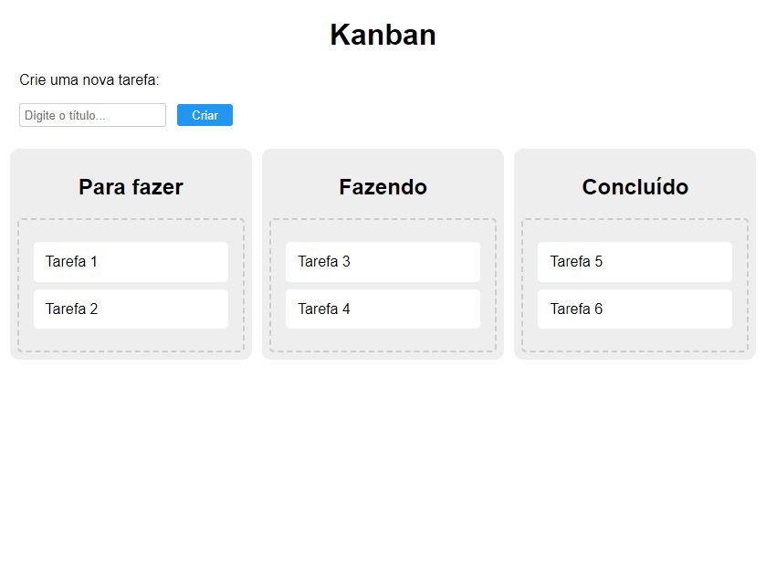

# Kanban

Projeto desenvolvido em HTML,CSS e Java Script. O site desenvolvido traz a proposta de um Kanban de modo simples e intuitivo. É possível criar novas tarefas, excluí-las u movê-las entre os quadros de acordo com o seu andamento.

🔗 [Click here to access](https://n4ju15.github.io/kanban/)

## Tecnologias

- HTML
- CSS
- JavaScript
- Git and Github

